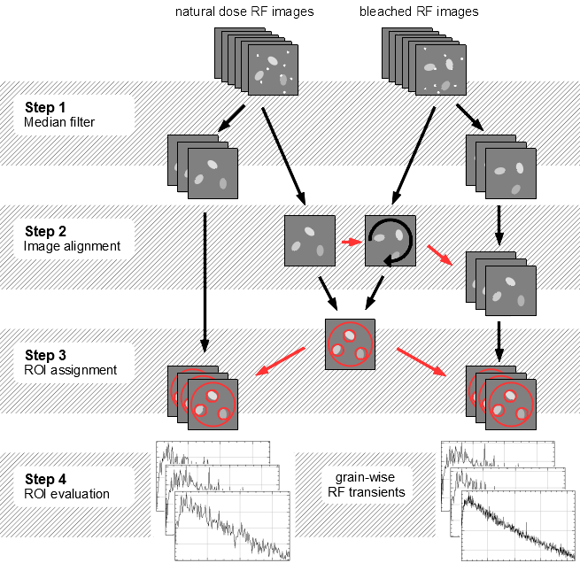
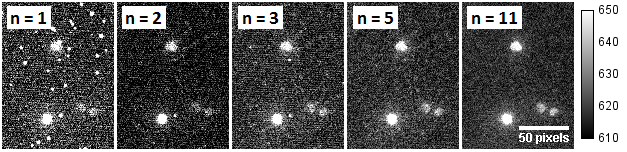

# Software description

This document details the use and the finer points of the image processing software presented in (Mittelstrass & Kreutzer 2021). The software enables the evaluation of **spatially resolved radiofluorescence (SR-RF)** measurements of sediment grains between ca 60 µm to 300 µm. All analysis performed so far, used a *Freiberg Instruments* [lexsyg research](http://www.lexsyg.com/tlosl-reader/lexsyg-research.html) device [@Richter_2013hu].

The software is based on a stand-alone version of the free image processing software [**ImageJ**](https://imagej.nih.gov/ij/index.html). It already contains the data processing macro, the necessary plug-ins and brings its own *Java runtime environment* for **Windows 64bit** systems.

## Migration to other platforms or ImageJ versions

If you like to run the software on a different platform, download *ImageJ* [here](https://imagej.nih.gov/ij/download.html). Also, you can use the RF-macro in the software solutions [Fiji](https://imagej.net/Fiji) and [Bio7](https://bio7.org/home-2/), or your *ImageJ* variant. In either case, you have to manipulate *ImageJ* in the following way:

-   copy the **SR-RF.ijm** **macro** file from the *`/macro`* subdirectory into the *`/macro`* subdirectory of your ImageJ version.

-   for enabling **image alignment**, copy the *`/plugins/Image alignment`* folder into your *`/plugins`*subdirectory or install [TurboReg](http://bigwww.epfl.ch/thevenaz/turboreg/) (already included in *Fiji*)

-   for supporting Princeton Instruments **WinView** files, copy the *`/plugins/`*`Input-Output` your *`/plugins`* subdirectory or install the [SPE plug-ins](https://imagej.nih.gov/ij/plugins/spe.html)

-   for having a **tool bar button**, copy the *`StartupMacros.txt`* file the */macro* subdirectory too or insert the following code line into your *`StartupMacros.txt`* variant:

<!-- -->

    macro "Spatial Resolved Radiofluorescence Action Tool - T1e12RTae12F" { runMacro("SR-RF.txt");}

## Troubleshooting

**Out of memory**: The maximum available memory of is set automatically at the first *ImageJ* start. Visit the [ImageJ troubleshooting webpage](https://imagej.net/Troubleshooting#OutOfMemoryError) how to increase the available memory.

**32bit-systems:** The *Java runtime environment* memory allocation at 32bit systems is limited to about 1.4 GB. This limits the overall size of the input files to about 0.6 -- 1 GB, depending on the macro settings.

**Conflicts with an older ImageJ installation:** There can be issues with some ImageJ functions, if an older version of ImageJ is or was installed at the user PC. Delete respectively rename the ImageJ preference file (*`IJ_prefs.txt`*) of the older installation in the *user application data* directory.

# Get started

## Step 1: Load image data

Open the raw image data sets. The SR-RF macro supports TIFF and SPE-files. At least two image stacks are needed: One containing the natural dose RF measurement and one containing the RF measurement after sample bleaching. Optionally a third image stack (or single image) defines the signal background. All images involved need to have the same width and height.

In case of parted data sets, combine the image stacks using the ImageJ menu command:

*Image Stacks Tools Combine ...*

## Step 2: Execute macro

To open the macro parameter dialog box, click on the ***Spatially Resolved Radiofluorescence Tool*** Button:

{width="4.67364in"}

Besides, the selection of the input files, there are multiple parameters explained in the parameter section. For unbinned RF images, the default settings should lead to reasonable results.

## Step 3: Edit ROIs (optional)

The macro will stop after automatic ROI determination and ask you if you want to manipulate the ROI selection. You can stretch, shrink, add and delete ROIs by using the [area selection tools](https://imagej.nih.gov/ij/docs/tools.html) and the [ROI manager](https://imagej.nih.gov/ij/docs/menus/analyze.html#manager) options. After you are done, click OK in the *Action Required* dialog box to continue with the macro execution.

**Hints:**

-   ROIs can be selected in the ROI manager or by clicking on its label in the image

-   ROIs can be deleted with the DEL key

-   a selected ROI can be moved by the arrow keys

-   to stretch/shrink a ROI without changing position and ratio, hold SHIFT + CTRL while doing so

-   to better draw new ROIs, the current ROI selection can be hidden by unchecking "Show All" in the ROI manager

-   the ROI manager is able of multi selection

-   one or multiple ROIs can be saved by clicking More Save.. in the ROI manager; previous saved ROIs can be added to the ROI collection

## Step 4: Close all images (optional)

After the macro is finished, another dialog box will appear. If you choose 'OK' all windows will be closed except the windows already open before macro execution. The macro can be restarted with different settings. Click on 'Cancel' and the workflow images will remain.

## Results

A subdirectory in the directory of the natural- dose-RF file is created. The folder is named by the natural- dose-RF file and the time stamp of the macro execution. All files in there are named and formatted consistently and independent of the source data, so they can be used in automatically created reports (like [R markdown](https://rmarkdown.rstudio.com/) reports). Every successful macro execution will put out the following result files:

-   **table.rf**: An ASCII file containing a XML like header for the settings and three CSV like tables with *tab stop* as delimiter. Table one gives the geometry of the ROIs. Table two and three give the ROI relating signal values of the natural dose RF and bleached RF image stacks

-   **ROIs.zip**: File containing the ROI selection, including the manually added and manipulated ROIs. This file can be opened by the ImageJ ROI manager

-   **superposition_scale.png**: The superposition image, explained in the Workflow section. A pixel scale bar and an intensity scale bar are drawn in. If the source image is smaller (or bigger) than 512 x 512 pixel, it will be stretched to 512 x 512 pixel

-   **superposition_ROIs_labeled.png**: The superposition image with the ROIs drawn in. The ROIs are numbered according to the table.rf file

Depending on the checked checkboxes, additional files will appear in the result folder:

-   **Save workflow images**: All the image data created during the macro execution will be saved as TIFF files

-   **Save additional pictures:** Varity of result pictures. They are tagged consistently for easy association. All files are scaled to 512 x 512 pixel size, except the "plain" files. All files are scaled to the same intensity-to-color dependence, except the "background", "difference" and "decay" files. The "difference" and "decay" pictures are created by first-minus-last image calculation

-   **Save signal decay videos:** AVI videos of the "natural" and "bleached" image stack. The compression is JPEG and the default frame rate is 10 per second (can be changed in the Hidden parameters of the macro)

# Method

## Overview

The sequence of the spatial resolved radiofluorescence (RF) macro is divided into four major steps: First, the raw image stacks of the two RF measurements are grouped and a median filter is applied. The median filter does not just smooth the data but also removes local signal spikes caused by ionizing radiation [@Velleman_1980jf]. Second, deviations in aliquot positioning between the both RF measurements are corrected by an image alignment algorithm [@Thevenaz_1998jk]. Third, the sample grains are identified by a local maximum search algorithm. Circles are drawn around the grains, defining each as region of interest (ROI). Forth, the mean value of each ROI at each image is calculated, building the grain wise RF transients. Finally, the RF transients are saved in a text file, allowing grain-wise RF analysis with the *R package 'Luminescence'* [@Kreutzer_2012ty] or other software. Optionally, RF decay videos and a variety of result pictures are saved.

## Step 1: Median filter

As first major step in the macro, the images of the source stacks are grouped in quantities according to the parameter **Group size**. The resulting groups are transformed to one subsequent image per group, generating two subsequent image stacks ("*nat*" and "*reg*") compressed by the factor of the group size. The transformation algorithm depends on the group size:

+--------------+---------------------------------------------------------------------------------------------------------------------------------------------+
| *Group size* |                                                                                                                                             |
+==============+=============================================================================================================================================+
| 1            | No transformation algorithm applied; The subsequent stacks are identical to the source stacks                                               |
+--------------+---------------------------------------------------------------------------------------------------------------------------------------------+
| 2            | For each x-y-coordinate of the two-image-group just the pixel with the lower intensity value is taken over in the subsequent image          |
+--------------+---------------------------------------------------------------------------------------------------------------------------------------------+
| ≥ 3          | For each x-y-coordinate, a [median](https://en.wikipedia.org/wiki/Median_filter) value is calculated and taken over in the subsequent image |
+--------------+---------------------------------------------------------------------------------------------------------------------------------------------+

The grouping process filters out signal spikes forming localized bright spots on the images. Uncorrected, they induce outlier values into the RF transients. Such spots are caused by the impacts of x-rays and gamma rays on the CCD. These high energy photons are emitted from the beta irradiation source of the measurement device. Minor roles play also cosmic rays.

These bright spots are just surviving the grouping process if the majority of pixels of one coordinate are affected by such events. Thus, the statistical likelihood of surviving spots decreases with increasing group size. At group size = 5 the probability of bright spots in the subsequent data is negligible (exposure times of just a few seconds and a beta source with a common activity level assumed).

**Further notes:**

-   The median grouping process works also as robust smoothing algorithm for the RF transients. It has no y-axis shifting effects like running average smoothing algorithms.

-   Group sizes of *n* = 4, 6, 8, ... have a higher likelihood of surviving spots as group sizes of *n* -- 1 = 3, 5, 7, ... and are therefore not recommended.

-   Group size of *n* = 2 is a more successful spot eraser as *n* = 3 but bias the signal towards lower values

-   <u>Recommended standard group size: *n* = 5\
    </u>

Figure : Same data section at different group sizes. n = 1: original data; n = 2: after minimum-of-two filter;\
n = 3, 5, 11: after median-of-n filter

### Background removal

While for a RF dose evaluation it is not necessary to background-correct the image data, it is reasonable for signal level examinations. Therefore a single image or an image stack can be defined to be subtracted from the filtered image stacks. If an image stack is selected for background removal, the median image is taken for subtraction. There are two approaches to create a background image stack:

-   Create a "free run" image series of at least 100 images. In LexStudio2 this can be performed with the trigger mode *TIMED* and the Machine control functions *Record*, *Abort* and *Save picture*. Use exactly the same camera settings (including CCD temperature!) for the free run image series as for the RF measurements. This creates background data including the ADC offset (usually around 600 cts/pixel) and the dark current signal.

-   Add an empty aliquot to the sample sequence. One of the both resulting no-RF measurements can be used as background stack. With this approach, the background data includes sample unrelated luminescence signals. Unwanted radioluminescence or Cherenkov light might be emitted from the optics or the sample carrier (Yukihara & McKeever 2011; page 249).

The second approach is recommended. It allows checking the measurement sequences for the steadiness of the background signals: Execute the macro with the background image stacks with a large group size and "Save additional result pictures" and "Save workflow images" checked. Analyze the RF transients of the Aliquot ROI afterwards and have a look at the "\_difference\_" and "\_decay\_" pictures. Is the background steady in a sufficient way, the saved *ROI_source.tiff* file can be used as background image for RF measurements performed with the same experimental set-up.

## Step 2: Image alignment

Sample arm moving may cause aliquot sliding. Uncorrected this would lead to a mismatch between the natural dose RF measurement and bleached RF measurement. To detect and correct such aliquot sliding, a median image of the whole natural dose RF image data is calculated and a median image of the whole bleached RF image data is calculated. The mean-square difference between both images serves as optimization value. The bleached RF median image is rotated and translated until the minimum is found. The rotation and translation parameters are applied at the grouped values stack of the bleached RF data. The used algorithm is the same as in @Greilich_2015ic. It applies the [TurboReg](http://bigwww.epfl.ch/thevenaz/turboreg/) plug-in based on Thévenaz et al. (1998).

The success of the image alignment process can be surveyed with a look at the ***medians_difference*** pictures of the additional result pictures. In case of an unsuccessful alignment, a black/white gradient, related to one direction should be visible.

Figure : Two *median_difference_scale.png* of the same data set: Left: image alignment deactivated; Right: image alignment successful

## Step 3: ROI assignment

For a grain wise RF analysis it is necessary to assign a region of interest (ROI) to each grain. To define these ROIs a 'ROI source' image is created. The ROI source image is the arithmetic mean image of the two output images from step 2: the natural dose RF median image and the aligned bleached RF median image. The ROI source picture is searched for local maximums. A local maximum gets marked if it is located inside an area with higher signal values than the surrounding. The threshold for these areas is user-defined by the **Noise tolerance** parameter. Around each marked maximum a circle is drawn, defining one ROI. The diameter of these circles is also user-defined by the **ROI diameter** parameter.

Noise tolerance parameter \*\*\
**This threshold allows skipping local maxima induced by background noise and luminescence light reflections. The necessary noise tolerance depends more on the experimental set-up (used sample carriers; grain density) and the camera settings (exposure time; ADC gain) than on the RF signal itself. Therefore it is reasonable to find a standard value for each new experimental set-up. To do so, run the macro with arbitrary ROI parameters (but the other parameters as planned) and "*Save workflow images*" checked. Afterwards, open the file** *ROI_source.tif*\*\* and use the ImageJ function ***Process*** ***Find Maxima...*** with the preview checked to find the optimal noise tolerance value.

ROI diameter parameter\
For ROI definition a circle is drawn around each marked local maximum. The diameter of these circles should be greater than the diameter of the grains measured. The relation between ROI diameter in pixels and ROI diameter in µm (relative to the sample) can be found out experimentally or calculated by the following formula:

$$D\_{\\text{ROI}}\\ \\left\\lbrack \\text{µm} \\right\\rbrack = D\_{\\text{ROI}}\\ \\left\\lbrack \\text{pixel} \\right\\rbrack\\ \\frac{\\ n\_{\\text{X.bin}}\\ d\_{\\text{pixel}}\\ \\left\\lbrack \\text{µm} \\right\\rbrack}{M\_{\\text{optics}}}$$

Here, *D*ROI is the ROI diameter, *n*X.bin is the binning size in one direction, *d*pixel is the size of a pixel on the CCD chip and *M*optics is the lateral magnification of the used optics.

At a *Freiberg Instruments lexsyg research system*, the magnification is about *M*optics  ≈ 0.6 (*lexsyg L2 Bordeaux* with f = 60 mm RF lens; NIR wavelength range). The exact magnification value depends on the optical build-up and the measured wavelength. The commonly used *Princeton Instruments ProEM512B+* camera has a pixel size of *d*pixel = 16 µm.

<u>Note</u>: *D*ROI should be somewhat larger than the average grain to diameter achieve a maximum SNR, because ...

-   the signal maximum is not necessarily in the middle of grain

-   usually, grains are not circular

-   optical errors and reflections at the sample carrier enlarge the grain images

As example, the following table shows some recommended values for the *lexsyg L2* in Bordeaux:

+---------------+------------------------+------------------------------+-----------------------+-----------------+
|               |                        | **recommended** DROI [pixel] |                       |                 |
+===============+========================+==============================+=======================+=================+
| ***Binning*** | ***Image pixel size*** | *fine grains\                | *intermediate grains\ | *coarse grains\ |
|               |                        | 50 - 80 µm*                  | 120 - 160 µm*         | 180 - 250 µm*   |
+---------------+------------------------+------------------------------+-----------------------+-----------------+
| *none*        | \~ 27 µm               | **5** (133 µm)               | **9** (243 µm)        | **12** (324 µm) |
+---------------+------------------------+------------------------------+-----------------------+-----------------+
| *2 x 2*       | \~ 53 µm               | **3** (160 µm)               | **5** (267 µm)        | **7** (371 µm)  |
+---------------+------------------------+------------------------------+-----------------------+-----------------+
| *4 x 4*       | \~ 107 µm              | **2** (213 µm)               | **3** (320 µm)        | **4** (427 µm)  |
+---------------+------------------------+------------------------------+-----------------------+-----------------+

Aliquot ROI\
To provide a signal reference, an 'aliquot ROI' is defined by the user. The geometrical parameters of this ROI are set in relative values so they are independent of pixel binning. The exact parameters have to be found manually, for example by placing luminescent grains at the rim of an aliquot. The signal value distribution inside the aliquot ROI of the ROI source image is used to define a color scale. This color scale is applied on all images and image stacks processed in the macro.

The RF data curves provided by the aliquot ROI may also be useful for:

-   comparison of camera and PMT measurements

-   comparisons of signal-to-noise ratios of different camera settings

-   estimated share of the single-grain-ROI signals

-   signal background stability test if analyzed at background measurement data

## Step 4: ROI evaluation

The arithmetic mean of each ROI at all images of the filtered and corrected image stacks are calculated. The consecutive mean values of one ROI form the signal respectively y-axis values of one grain-related RF curve. The x-axis respectively time axis are calculated by the predefined parameters **Group size** and **Channel time**. As x-value serves the middle of the time span, where the images of the y-value related image group was measured:

$t\_{i} = \\left( i - \\frac{1}{2} \\right)\\ n\_{\\text{group}}\\ t\_{\\text{channel}}$ $$s$$

Here, *t*i is the x-value in seconds; *i* is the index of the y-value respectively the image group; *n*group is the group size (see step 1); *t*channel is the channel time in seconds.

The values for the natural dose RF data and the bleached RF data are saved as separate tables into one ASCII file (*table.rf*). Prior the value tables another table is written into *table.rf* showing the position and size of each ROI.

## Hidden options

### Remove outliers

Hidden in the header of the macro text file and not shown at the macro dialog box, is an alternative bright spot removing algorithm. It might be useful if the image grouping step shall be skipped (group size = 1) to maintain full time resolution. The algorithm applies the ImageJ *Remove outliers* function:

*Process Noise Remove outliers...*

Is the *Threshold* value set to high and/or the *Tracer Radius* set to low, the bright spots will not be fully erased. Is the *Threshold* value set to low and/or the *Tracer Radius* set to high, actual luminescence signals may be flattened.

### Color scale

The color scheme (lookup tables = LUT) for the images can be changed by the **Display LUT** parameter. The parameter value equals the LUT name found at:

*Images Lookup Tables ...*

The LUT choice relies on the scientific question and the users preferences. Some LUTs allow for better signal intensity rating of the grains, others show background noise and signal cross talk better.

Figure : LUT examples; from left to right: "Grays" (ImageJ default),"Blue Orange icb" (macro default), "Spectrum", "16 Colors"

# Macro sequence

The following table gives a detailed description of the macros work flow. The step number orients at the Method section. Most of the macro steps can be accomplished manually by using the ImageJ menu commands and tools. Words in serif letters names actual images and image stacks.

+--------------+----------------------------------------------------------------------------------------------------------------------------------------------------------------------------------------------------------------------------------------------------------------------------------------------------------------------------------------------------------------------------------------------------------------+---------------------------+---------------------------------------------------+
| *Macro step* | ***Description***                                                                                                                                                                                                                                                                                                                                                                                              | ***ImageJ menu command*** | ***ImageJ windows / data stream***                |
+==============+================================================================================================================================================================================================================================================================================================================================================================================================================+===========================+===================================================+
| 0            | The user defines the source image stacks and the macro parameters.                                                                                                                                                                                                                                                                                                                                             |                           | **Macro dialog box** s*ource stacks, parameters,\ |
|              |                                                                                                                                                                                                                                                                                                                                                                                                                |                           | save path*                                        |
|              | As save path for the results, a subdirectory in the natural-dose-RF-measurement file directory is created: *[name of\* nat \*source file]\_[date & time of macro start]*                                                                                                                                                                                                                                       |                           |                                                   |
+--------------+----------------------------------------------------------------------------------------------------------------------------------------------------------------------------------------------------------------------------------------------------------------------------------------------------------------------------------------------------------------------------------------------------------------+---------------------------+---------------------------------------------------+
| 1.1          | The number of slices of the source image stacks is reduced to a multiple of the group size. This is done by deleting the last slices until the numbers fit.                                                                                                                                                                                                                                                    | *Image\                   | *Source stacks*                                   |
|              |                                                                                                                                                                                                                                                                                                                                                                                                                | Stacks\                   |                                                   |
|              |                                                                                                                                                                                                                                                                                                                                                                                                                | Delete slices*            |                                                   |
+--------------+----------------------------------------------------------------------------------------------------------------------------------------------------------------------------------------------------------------------------------------------------------------------------------------------------------------------------------------------------------------------------------------------------------------+---------------------------+---------------------------------------------------+
| 1.2          | The slices of the source stacks are grouped depending on the parameter Group size. The images of each group are projected into single images. The projection equals a Minimum intensity filter or a Median filter, depending on the group size. The natural dose RF source images are projected into the "nat"ural dose stack; the bleached RF source images are projected into the dose "reg"eneration stack. | *Image\                   | *Source stacks\                                   |
|              |                                                                                                                                                                                                                                                                                                                                                                                                                | Stacks\                   | *nat*,* reg                                       |
|              |                                                                                                                                                                                                                                                                                                                                                                                                                | Tools\                    |                                                   |
|              |                                                                                                                                                                                                                                                                                                                                                                                                                | Grouped Z project ...*    |                                                   |
+--------------+----------------------------------------------------------------------------------------------------------------------------------------------------------------------------------------------------------------------------------------------------------------------------------------------------------------------------------------------------------------------------------------------------------------+---------------------------+---------------------------------------------------+
| 1.3          | ***Optional and hidden***:\                                                                                                                                                                                                                                                                                                                                                                                    | *Process\                 | nat*,* reg                                        |
|              | An outlier removal algorithm is applied to all nat and reg slices                                                                                                                                                                                                                                                                                                                                              | Noise\                    |                                                   |
|              |                                                                                                                                                                                                                                                                                                                                                                                                                | Remove outliers ...*      |                                                   |
+--------------+----------------------------------------------------------------------------------------------------------------------------------------------------------------------------------------------------------------------------------------------------------------------------------------------------------------------------------------------------------------------------------------------------------------+---------------------------+---------------------------------------------------+
| 1.4          | ***Optional***: The background image is subtracted from all nat and reg slices. The data type switch at this point from UINT16 to INT32 to allow negative signal values is applied. This will double the file size of nat and reg and increases the memory requirement                                                                                                                                         | *(Image\                  | nat = nat -- background                           |
|              |                                                                                                                                                                                                                                                                                                                                                                                                                | Stacks\                   |                                                   |
|              | If an image stack is given as background, the median projection of the stack will serve as background image                                                                                                                                                                                                                                                                                                    | Z Project...)*            | reg = reg - background                            |
|              |                                                                                                                                                                                                                                                                                                                                                                                                                |                           |                                                   |
|              |                                                                                                                                                                                                                                                                                                                                                                                                                | *Process\                 |                                                   |
|              |                                                                                                                                                                                                                                                                                                                                                                                                                | Image Calculator ...*     |                                                   |
+--------------+----------------------------------------------------------------------------------------------------------------------------------------------------------------------------------------------------------------------------------------------------------------------------------------------------------------------------------------------------------------------------------------------------------------+---------------------------+---------------------------------------------------+

\*\*\
\*\*

+-----+----------------------------------------------------------------------------------------------------------------------------------------------------------------------------------------------------------------------------------------------------------------------------------------------------------------------------------------------------------------------------------------+-----------------------+------------------------------------------+
| 2.1 | Whole-stack median projections of nat and reg create MEDIAN_nat and MEDIAN_reg. In the following, they are used as representatives of the two measurements                                                                                                                                                                                                                             | *Image\               | nat*,* reg MEDIAN_nat,MEDIAN_reg         |
|     |                                                                                                                                                                                                                                                                                                                                                                                        | Stacks\               |                                          |
|     |                                                                                                                                                                                                                                                                                                                                                                                        | Z Project...*         |                                          |
+=====+========================================================================================================================================================================================================================================================================================================================================================================================+=======================+==========================================+
| 2.2 | ***Optional***: An image alignment algorithm minimizes the deviation between MEDIAN_nat and MEDIAN_reg and gives the translation and rotation parameters back. This is not manually accomplishable but applying the TurboReg plugin with the RigidBody approach. The algorithm is based on the [**turboreg example macro**](http://bigwww.epfl.ch/thevenaz/turboreg/turboRegMacro.txt) | Similar function:*\   | MEDIAN_nat, MEDIAN_reg\                  |
|     |                                                                                                                                                                                                                                                                                                                                                                                        | Plugins\              | *Log*                                    |
|     |                                                                                                                                                                                                                                                                                                                                                                                        | Image alignment\      |                                          |
|     |                                                                                                                                                                                                                                                                                                                                                                                        | TurboReg ...*         |                                          |
+-----+----------------------------------------------------------------------------------------------------------------------------------------------------------------------------------------------------------------------------------------------------------------------------------------------------------------------------------------------------------------------------------------+-----------------------+------------------------------------------+
| 2.3 | The parameters are applied to the whole reg stack and MEDIAN_reg                                                                                                                                                                                                                                                                                                                       | *Image\               | *Log* reg, MEDIAN_reg                    |
|     |                                                                                                                                                                                                                                                                                                                                                                                        | Transform\            |                                          |
|     |                                                                                                                                                                                                                                                                                                                                                                                        | Rotate ...\           |                                          |
|     |                                                                                                                                                                                                                                                                                                                                                                                        | Image\                |                                          |
|     |                                                                                                                                                                                                                                                                                                                                                                                        | Transform\            |                                          |
|     |                                                                                                                                                                                                                                                                                                                                                                                        | Translate ...*        |                                          |
+-----+----------------------------------------------------------------------------------------------------------------------------------------------------------------------------------------------------------------------------------------------------------------------------------------------------------------------------------------------------------------------------------------+-----------------------+------------------------------------------+
| 3.1 | MEDIAN_nat and MEDIAN_reg are combined to ROI_source applying the arithmetic mean                                                                                                                                                                                                                                                                                                      | *Process\             | (MEDIAN_nat + MEDIAN_reg)/2 = ROI_source |
|     |                                                                                                                                                                                                                                                                                                                                                                                        | Image Calculator ...* |                                          |
+-----+----------------------------------------------------------------------------------------------------------------------------------------------------------------------------------------------------------------------------------------------------------------------------------------------------------------------------------------------------------------------------------------+-----------------------+------------------------------------------+
| 3.2 | The ROI source picture is searched for local maximums. They get marked, if they lay in an area which values are a predefined threshold higher than of the surrounding area (noise tolerance)                                                                                                                                                                                           | *Process\             | ROI_source *ROI manager*                 |
|     |                                                                                                                                                                                                                                                                                                                                                                                        | Find Maxima...*       |                                          |
+-----+----------------------------------------------------------------------------------------------------------------------------------------------------------------------------------------------------------------------------------------------------------------------------------------------------------------------------------------------------------------------------------------+-----------------------+------------------------------------------+
| 3.3 | Around each marked maximum, a circle with predefined radius is outlined. These circles represent the ROIs                                                                                                                                                                                                                                                                              | Similar function:*\   | *ROI manager*                            |
|     |                                                                                                                                                                                                                                                                                                                                                                                        | Toolbar*\             |                                          |
|     |                                                                                                                                                                                                                                                                                                                                                                                        | *Make* *Oval*         |                                          |
+-----+----------------------------------------------------------------------------------------------------------------------------------------------------------------------------------------------------------------------------------------------------------------------------------------------------------------------------------------------------------------------------------------+-----------------------+------------------------------------------+
| 3.4 | ***Macro stop:*** The user can rearrange and modify the ROI collection by using the selection functions of the toolbox or the ROI manager                                                                                                                                                                                                                                              |                       | *ROI manager,\                           |
|     |                                                                                                                                                                                                                                                                                                                                                                                        |                       | Selection tools*                         |
+-----+----------------------------------------------------------------------------------------------------------------------------------------------------------------------------------------------------------------------------------------------------------------------------------------------------------------------------------------------------------------------------------------+-----------------------+------------------------------------------+
| 4.1 | The ROI collection is applied to all nat and reg. Text strings are continuously built, containing the arithmetic mean signal value of each ROI in each image                                                                                                                                                                                                                           | Similar function:*\   | *ROI manager\                            |
|     |                                                                                                                                                                                                                                                                                                                                                                                        | ROI manager\          | * nat*,* reg\                            |
|     |                                                                                                                                                                                                                                                                                                                                                                                        | More ...\             | *Results*                                |
|     |                                                                                                                                                                                                                                                                                                                                                                                        | Multi measure*        |                                          |
+-----+----------------------------------------------------------------------------------------------------------------------------------------------------------------------------------------------------------------------------------------------------------------------------------------------------------------------------------------------------------------------------------------+-----------------------+------------------------------------------+
| 4.2 | The mean-value strings are saved in *table.rf* together with the ROI properties and the macro settings                                                                                                                                                                                                                                                                                 | *Results\             | *Results\                                |
|     |                                                                                                                                                                                                                                                                                                                                                                                        | File\                 | ***table.rf**                            |
|     |                                                                                                                                                                                                                                                                                                                                                                                        | Save as...*           |                                          |
+-----+----------------------------------------------------------------------------------------------------------------------------------------------------------------------------------------------------------------------------------------------------------------------------------------------------------------------------------------------------------------------------------------+-----------------------+------------------------------------------+
|     | Depending on the macro settings, the work flow data (nat, reg, MEDIAN_nat, MEDIAN_reg, ROI_source), various result pictures and two videos showing nat and reg are also saved                                                                                                                                                                                                          |                       |                                          |
+-----+----------------------------------------------------------------------------------------------------------------------------------------------------------------------------------------------------------------------------------------------------------------------------------------------------------------------------------------------------------------------------------------+-----------------------+------------------------------------------+

# Miscellaneous

## Macro editing

-   The ImageJ macro language is a derivative of *JavaScript*. An overview of the built-in macro functions can be found [here](http://rsb.info.nih.gov/ij/developer/macro/functions.html)

-   For editing the macro, the free software [Notepad++](http://notepad-plus-plus.org/) with the language setting "JavaScript" is highly recommended

-   You like to add another processing step, but you don't know how to program? Have a look at *Plugins Macros Record...*

## Some considerations for further developments

The SR-RF macro leaves plenty room for enhancements:

-   A subject for improvements is the median grouping algorithm. More sophisticated algorithms deploy multiple running median processes (Velleman 1980). For example, a (53H, twice)-algorithm would mostly maintain time resolution while being still as powerful in spike-removing as a n=5 group median. Another example: A (4253H, twice)-algorithm would maintain the shape of the underlying RF curve while smoothing away not just signal spikes but also much of the Gaussian noise.

-   One issue might be signal cross talk [@Gribenski_2015br]. To solve this problem, some *ImageJ* plug-ins for image deconvolution are available. For example [this](http://imagej.net/Parallel_Iterative_Deconvolution). To use these, the [point spread function (PSF)](http://en.wikipedia.org/wiki/Point_spread_function) need to be known. The PSF might be achievable with the measurement of a single bright grain (Al2O3:C or bleached K-feldspar) of small size (\~ 20µm). But applying a PSF will decrease the SNR somewhat.

-   *ImageJ* is powerful enough to calculate the equivalent doses of the grains as part of the macro. An example, how to use the necessary fitting functions can be found [here](http://rsb.info.nih.gov/ij/macros/examples/CurveFittingDemo.txt).

-   There is a way to control the camera directly in *ImageJ*. The necessary plug-in is called [Micro-Manager](https://www.micro-manager.org/wiki/Micro-Manager). Together with the 64bit [PICAM](https://micro-manager.org/wiki/PICAM) driver ([download here](ftp://ftp.princetoninstruments.com/Public/Software/Official/PICam/)), it should be possible to run the camera on a 64bit environment and get rid of the *WinView* and *LexStudio2* restrictions

# References {.unnumbered}
